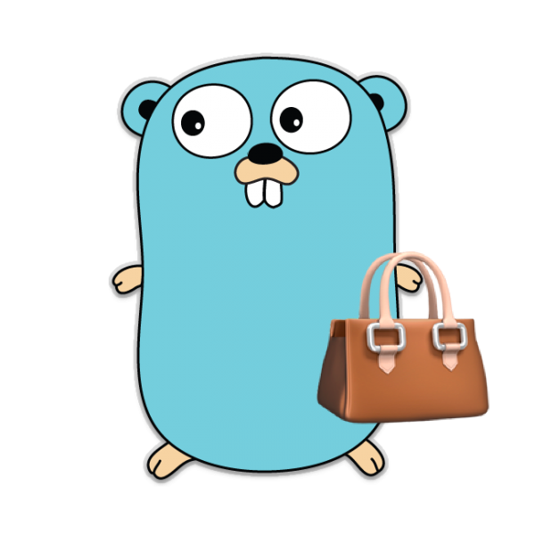

<center>

</center>

# Callbag.go

[Callbag](https://github.com/callbag/callbag) pattern was discovered by [André Staltz](https://github.com/staltz), and I was facinated by the simplicity of its api and how it has simplified writing data/stream processing tasks. So I decided to port it to Go. The new version takes advantage of Generics in Go 1.18 so no more `interface{}` and `reflect`, Yay!!! 🥳

the entrie API is based on the a single function type.

```golang
type Type int

const (
	Hello Type = iota
	Data
	Bye
)

type Option[T any] struct {
	Data T
	Err  error
	Func Func[T]
	Type Type
}

type Func[T any] func(opt Option[T]) // <-- that's all you need
```

At the moment the following functions have been implemented

- [x] [FromInterval](#frominterval)
- [x] [FromSlice](#fromslice)
- [x] [FromRange](#fromrange)
- [x] [FromChannel](#fromchannel)
- [x] [Filter](#filter)
- [x] [Map](#map)
- [x] [ParallelMap](#parallelmap)
- [x] [Group](#group)
- [x] [Flatten](#flatten)
- [x] [Take](#take)
- [x] [ForEach](#foreach)
- [x] [ToChannel](#tochannel)
- [x] [Pipe](#pipe)
- [x] [Compose](#compose)

# Installtion

you can either copy/paste the content of [callbag.go](https://github.com/alinz/callbag.go/blob/main/callbag.go) inside your project or run the follwing command inside your go project.

```bash
go get github.com/alinz/callbag.go
```

# Documentation

> All functions are designed to be async/lazy, which means you need to wait for them, or it will be killed once the program ends. One option is to wait for the end of the stream using `ForEach` or `ToChannel` function. All the examples provided the mechanisum to wait for the stream to be ended.

## FromInterval

Generates a tick and send an incermental integer value every n's `time.Duration`.

```golang
package main

import (
	"fmt"
	"time"
	"sync"

	cb "github.com/alinz/callbag.go"
)

func main() {
	var wg sync.WaitGroup

	wg.Add(1)

	cb.Pipe2(
		cb.FromInterval[int](1 * time.Second),
		cb.ForEach(func (value int, done bool) {
			if done {
				wg.Done()
				return
			}

			fmt.Printf("value is %d\n", value)
		}),
	)

	// because FromInterval never ends, this program will prints values
	// to the end of the world, possible event after that :))
	wg.Wait()
}
```

## FromSlice

If the input is a slice, it can be converted into callbag stream by using `FromSlice` function as a source. Because slice is Finite, the stream will autoamatically ends once it processes the last item.

```golang
package main

import (
	"fmt"
	"time"
	"sync"

	cb "github.com/alinz/callbag.go"
)

func main() {
	var wg sync.WaitGroup

	wg.Add(1)

	cb.Pipe2(
		cb.FromSlice([]int{1, 2, 3, 4, 5}),
		cb.ForEach(func (value int, done bool) {
			if done {
				wg.Done()
				return
			}

			fmt.Printf("value is %d\n", value)
		}),
	)

	wg.Wait()
}
```

## FromRange

Generates number values from n to m with step value. It will stream will be terminated by the last iteration.

```golang
package main

import (
	"fmt"
	"sync"

	cb "github.com/alinz/callbag.go"
)

func main() {
	var wg sync.WaitGroup

	wg.Add(1)

	cb.Pipe2(
		cb.FromRange(1, 10, 2),
		cb.ForEach(func(value int, done bool) {
			if done {
				wg.Done()
				return
			}

			fmt.Printf("value is %d\n", value)
		}),
	)

	wg.Wait()
}
```

## FromChannel

Converts a given channel into callbag stream. The stream will be termnated once channel is closed.

```golang
package main

import (
	"fmt"
	"sync"

	cb "github.com/alinz/callbag.go"
)

func main() {
	var wg sync.WaitGroup

	wg.Add(1)

	ch := make(chan int, 10)
	for i := 0; i < 10; i++ {
		ch <- i
	}
	close(ch)

	cb.Pipe2(
		cb.FromChannel(ch),
		cb.ForEach(func(value int, done bool) {
			if done {
				wg.Done()
				return
			}

			fmt.Printf("value is %d\n", value)
		}),
	)

	wg.Wait()
}
```

## Filter

This function can be used to filter out any items inside stream from going through the stream.

```golang
package main

import (
	"fmt"
	"sync"

	cb "github.com/alinz/callbag.go"
)

func main() {
	var wg sync.WaitGroup

	wg.Add(1)

	cb.Pipe3(
		cb.FromRange(1, 100, 1),
		cb.Filter(func(value int) bool {
			return value%2 == 0
		}),
		cb.ForEach(func(value int, done bool) {
			if done {
				wg.Done()
				return
			}

			// prints out all even number between [1,100)
			fmt.Printf("value is %d\n", value)
		}),
	)

	wg.Wait()
}
```

## Map

Transforms one value to another.

```golang
package main

import (
	"fmt"
	"sync"

	cb "github.com/alinz/callbag.go"
)

func main() {
	var wg sync.WaitGroup

	wg.Add(1)

	cb.Pipe3(
		cb.FromRange(1, 10, 1),
		cb.Map(func(value int) string {
			return fmt.Sprintf("Hello %d", value)
		}),
		cb.ForEach(func(value string, done bool) {
			if done {
				wg.Done()
				return
			}

			fmt.Printf("value is %s\n", value)
		}),
	)

	wg.Wait()
}
```

## ParallelMap

This function is a special case of map that creates N number of goroutines to process the data. It put the processed data back to its original index location. The number of goroutines is determined by the length of input.

```golang
package main

import (
	"fmt"
	"sync"

	cb "github.com/alinz/callbag.go"
)

func main() {
	var wg sync.WaitGroup

	wg.Add(1)

	cb.Pipe4(
		cb.FromRange(1, 11, 1),
		cb.Group[int](2),
		cb.ParallelMap(func(value int) string {
			return fmt.Sprintf("Hello %d", value)
		}),
		cb.ForEach(func(value []string, done bool) {
			if done {
				wg.Done()
				return
			}

			fmt.Printf("value is %s\n", value)
		}),
	)

	wg.Wait()
}
```

## Group

This function groups N number of items into a single slice item. This function is useful when you want to use ParallelMap to process N number and once the proces is done, you can use Flatten to flatten the data back to a stream of items.

```golang
package main

import (
	"fmt"
	"sync"

	cb "github.com/alinz/callbag.go"
)

func main() {
	var wg sync.WaitGroup

	wg.Add(1)

	cb.Pipe3(
		cb.FromRange(1, 11, 1),
		cb.Group[int](2),
		cb.ForEach(func(value []int, done bool) {
			if done {
				wg.Done()
				return
			}

			fmt.Printf("value is %v\n", value)
		}),
	)

	wg.Wait()
}
```

## Flatten

This function converts a stream of slices into a stream of single item

```golang
package main

import (
	"fmt"
	"sync"

	cb "github.com/alinz/callbag.go"
)

func main() {
	var wg sync.WaitGroup

	wg.Add(1)

	cb.Pipe4(
		cb.FromRange(1, 11, 1),
		cb.Group[int](2),
		cb.Flatten[int](),
		cb.ForEach(func(value int, done bool) {
			if done {
				wg.Done()
				return
			}

			fmt.Printf("value is %v\n", value)
		}),
	)

	wg.Wait()
}
```

## Take

This function gets the N number of items and stop the stream. This function is usful if you are dealing with large or infinite streams.

```golang
package main

import (
	"fmt"
	"sync"
	"time"

	cb "github.com/alinz/callbag.go"
)

func main() {
	var wg sync.WaitGroup

	wg.Add(1)

	cb.Pipe3(
		cb.FromInterval[int](1*time.Second),
		cb.Take[int](3),
		cb.ForEach(func(value int, done bool) {
			if done {
				wg.Done()
				return
			}

			fmt.Printf("value is %d\n", value)
		}),
	)

	wg.Wait()
}
```

## ForEach

This is a sink function and should be used as the last function in a stream. Once the stream is terminated, the done argument will be set to true

## ToChannel

This function is a special case of ForEach function that push all the items to a given channel. Once the stream is terminated, This fucntion will automatically close the channel.

## Pipe

Pipe is a helper function that let's combined all types of callbag functions. There are number of varity of this function, `Pipe2`, `Pipe3`, `Pipe4`, ..., `Pipe10`. The N represents the number of callbag function you can combined. The first argument must be a source, and the last argument must be a sink function. The rest of the arguemnts can be set with all modifier callbag functions.

## Compose

Similar to Pipe, Compose is a helper function to compose multiple modifier callbag functions. The compose functions can not accept either of soucre or sink functions.

```golang
package main

import (
	"fmt"
	"sync"

	cb "github.com/alinz/callbag.go"
)

func main() {
	var wg sync.WaitGroup

	wg.Add(1)

	comp1 := cb.Compose2(
		cb.Group[int](2),
		cb.Flatten[int](),
	)

	cb.Pipe3(
		cb.FromRange(1, 11, 1),
		comp1, // <- replace 2 callbag functions with one
		cb.ForEach(func(value int, done bool) {
			if done {
				wg.Done()
				return
			}

			fmt.Printf("value is %v\n", value)
		}),
	)

	wg.Wait()
}
```
